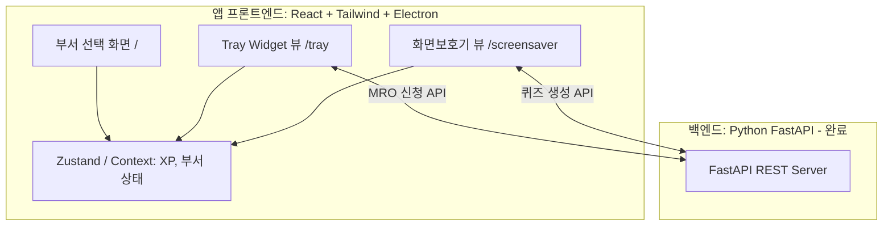

# iM루키 (iM Rookie) Hackathon Demo Implementation Plan

## Goal Description
아이디어 해커톤 경진대회 출품용 사내 맞춤형 AI 서무 에이전트 'iM루키(iM Rookie)' 프로토타입의 아키텍처 및 구현 계획입니다. 본 데모는 망분리 환경을 고려하지 않고 빠른 시연과 시각적으로 멋진 결과물을 도출하기 위해 외부 클라우드 API(Gemini, Slack Webhook)를 적극 활용합니다.

## Architecture Diagram (Current State)

---

## Phase 3: Frontend (Electron + React) Proposed Changes

### 1. 프론트엔드 환경 초기화 및 세팅
- **스택**: `Vite` + `React` + `TailwindCSS` + `Electron`
- **핵심 라이브러리**: 애니메이션(`framer-motion`), 라우팅(`react-router-dom`), 아이콘(`lucide-react`)
- **디자인 컨셉**: 금융권의 신뢰감을 주는 'Deep Blue' 포인트 컬러와 반투명 블러 처리가 들어간 **Glassmorphism 테마** 적용.

### 2. 컴포넌트 뷰 (Views) 라우팅 구조 설계
데스크톱 앱뿐만 아니라 웹 브라우저 상태에서도 화면 캡처 및 시연이 가능하도록 URL 기반의 라우팅 구조를 갖춥니다.
- **`/` (초기 부서 선택 화면)**: 앱 구동 시 가장 먼저 나타나며, 5개 부서(IT, Sales, Compliance, HR, Marketing) 중 하나를 선택해 전역 상태에 저장합니다.
- **`/tray` (트레이 위젯 UI)**:
  - 캐릭터 프로필 뱃지 및 현재 XP/Level 바.
  - 대화형 입력창 내장.
  - 레벨업 시 잠금 해제(Unlock)되는 [비품 신청(RPA)] 액션 버튼.
- **`/screensaver` (화면보호기 UI)**:
  - 풀스크린 글래스모피즘 퀴즈 화면.
  - 10초 이상 마우스/키보드 움직임이 없으면(Idle Timeout 커스텀 훅) 자동으로 해당 뷰로 전환.
  - 퀴즈 정답을 맞히면 화려한 파티클/모션 이펙트와 함께 경험치 획득 후 원래 화면으로 복귀.

### 3. 상태 관리 (State Management)
- 사용자가 선택한 **'부서 정보'**와 퀴즈를 풀고 얻은 **'XP(경험치) 및 Level'**을 전역 상태로 관리합니다.
- 레벨 2에 도달하면 `/tray` 화면의 [비품 신청] 로직이 활성화되며, 누를 경우 FastAPI 쪽에 MRO POST API를 쏴서 Slack 데모를 완수합니다.

---

## Open Questions (User Review Required)

> [!IMPORTANT]
> **Browser Agent 캡처와 설계 방식에 대한 확인**
>
> 1. 실제 OS 시스템 트레이(Windows 우측 하단 아이콘) 자체는 브라우저 에이전트 봇이 클릭하여 테스트할 수 없습니다. 따라서 설계 시 **"웹 브라우저를 통해서도 트레이 위젯 모양의 화면(`/tray`)과 화면보호기 화면(`/screensaver`)에 접속해 완벽한 UI 데모와 스크린샷 캡처가 가능하도록"** 하이브리드 싱글페이지(SPA) 웹 구조를 기반으로 데스크톱 앱을 포장하는 방식을 강력히 추천합니다. 이 구조로 진행해도 괜찮을까요?
> 2. 초기 퀴즈 테스트를 위해 백엔드 API (`http://localhost:8000`) 서버가 구동된 상태로 프론트엔드가 띄워져야 하므로 백엔드 서버도 백그라운드로 띄워서 진행하겠습니다!

## Verification Plan (Phase 3)
### Automated & Agent Tests
- 프론트엔드 빌드 후 React 개발 서버(`http://localhost:5173`)를 구동합니다.
- 자체 `browser_subagent` 도구를 호출하여 브라우저 환경에서 직접 부서 선택 ➡️ 대기 모드 진입(화면보호기) ➡️ 퀴즈 렌더링 화면 등에 대한 **세팅별 스크린샷을 스스로 촬영하고 Artifact에 첨부**합니다.
